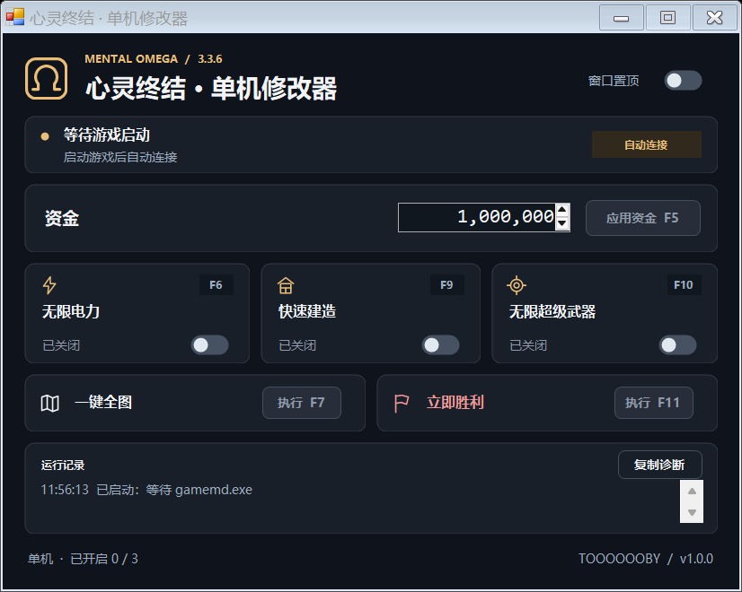

# 心灵终结单机修改器

给《心灵终结》3.3.6 用的单机修改器。改资金、开全图，或者少等一会儿造建筑和单位，常用的几项放在一个窗口里。

**[下载 1.0.0](https://github.com/TOOOOOOBY-Q/mental-omega-trainer/releases/download/v1.0.0/mental-omega-trainer-1.0.0.exe)** · [发布记录](https://github.com/TOOOOOOBY-Q/mental-omega-trainer/releases) · [反馈问题](https://github.com/TOOOOOOBY-Q/mental-omega-trainer/issues)

下载 exe 就能用，不需要安装。先开游戏、进一局，再开修改器；点按钮或按快捷键都行。只用于本地单机。



## 功能

| 功能 | 快捷键 |
| --- | --- |
| 设置资金 | F5 |
| 无限电力 | F6 |
| 一键全图 | F7 |
| 快速建造 | F9 |
| 无限超级武器 | F10 |
| 立即胜利 | F11 |

资金按输入的数值设置。快速建造仍会扣钱，资金不足就等；建筑要自己放，单位也保留出厂动画。电力、建造和超武是开关，全图和胜利是一次性操作。

## 这次改了什么

主要处理了两个问题：电力表满了还在停电；快速建造开了还是不够快。供电改为在游戏结算时处理，建造直接推进到最后一步。界面也重新整理了，固定缩放，删掉多余说明，避免标题和快捷键显示不全。

**已在正式 AI 遭遇战中验证可用，验收通过。** 代码另有模拟进程、指令仿真和界面检查。

修改器版本从 **1.0.0** 重新编号，适配的游戏版本仍是 **3.3.6**。从旧版换过来，先关旧修改器并重启游戏。

## 运行环境

Windows 10 / 11，.NET Framework 4.x。游戏为 Mental Omega 3.3.6，基于 Yuri's Revenge 1.001 + Ares 3.0。

启动时会申请管理员权限，用来访问游戏进程。程序不联网、不改游戏目录，也没有广告或自动更新。1.0.0 的 exe 未签名；下载后可用 Release 里的 `SHA256SUMS.txt` 核对文件。

## 自己编译

Windows 自带的 .NET Framework C# 编译器就够了，不需要 Visual Studio。

```powershell
git clone https://github.com/TOOOOOOBY-Q/mental-omega-trainer.git
cd mental-omega-trainer
powershell -ExecutionPolicy Bypass -File scripts\Build.ps1
```

生成文件在 `release\心灵终结修改器_MO336.exe`。

```powershell
# 电力和建造回归检查
powershell -ExecutionPolicy Bypass -File scripts\Test-Power.ps1

# 界面检查，不连接游戏
powershell -ExecutionPolicy Bypass -File scripts\Test-Ui.ps1
```

可选的指令仿真需要 Python 和 `unicorn==2.1.4`，给 `Test-Power.ps1` 加上 `-Python python` 即可。源码里，`MOTrainer336.cs` 处理游戏操作，`TrainerUi.cs` 负责界面，电力和建造补丁各在独立文件中。

## 有问题

先确认游戏版本；没进对局时，按钮会暂时禁用。快捷键被别的程序占用，可以直接点按钮。

还有问题就提 [Issue](https://github.com/TOOOOOOBY-Q/mental-omega-trainer/issues)，写清楚怎么触发，再附上“复制诊断”的内容。诊断会包含游戏路径，提交前可以删掉不想公开的部分。

更多细节：[使用说明](docs/usage.md) · [架构](docs/architecture.md) · [内存偏移](docs/memory-offsets.md) · [变更记录](CHANGELOG.md)

## 许可证

[MIT](LICENSE)。兼容性思路参考了 [RA2YurisRevengeTrainer](https://github.com/AdjWang/RA2YurisRevengeTrainer)，没有复制其代码。
